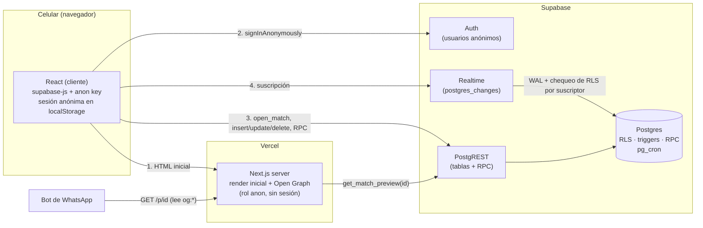

# fulb05 · Armá el partido

[](https://github.com/NicWr25/fulb05/actions/workflows/ci.yml)

App web (pensada para el celular) para armar equipos de **fútbol 5 o 7** entre amigos.
Alguien crea el partido, pasa el link por WhatsApp y cada uno entra, pone su nombre y
elige equipo. Todos ven lo mismo, en vivo, sin registrarse.

- **Anotarse sin cuenta**: cada navegador recibe una identidad anónima.
- **Cancha interactiva**: tu ficha entra desde el centro y después la arrastrás para
  acomodarte dentro de la mitad de tu equipo. Las remeras afuera muestran los lugares.
- **Capacidad exacta**: juegan 5 vs 5 o 7 vs 7; cuando un equipo se llena, no se anotan más jugadores en él.
- **En vivo**: los cambios de cualquiera aparecen en todos los celulares sin recargar.
- **Organizador**: agrega gente que no usa la app, saca jugadores, cambia formato,
  día, hora o cancha, acomoda cualquier ficha e intercambia dos jugadores tocándolos
  desde el navegador donde creó el partido.
- **Vista previa en WhatsApp**: `Fútbol 5 · Jueves 21:00 · Cancha X` con imagen propia.
- **Se borra solo**: los partidos desaparecen 7 días después de jugarse.

## Stack

| Capa | Tecnología |
|---|---|
| Frontend | Next.js 16 (App Router) · React 19 · TypeScript · Tailwind CSS v4 |
| Backend | Supabase: Postgres con Row Level Security, Realtime, Auth anónima, pg_cron. **Sin servidor propio** |
| Hosting | Vercel (frontend) + Supabase Cloud (base) |
| Tests | Vitest (unitarios e integración) · pgTAP (base de datos) |

Dependencias de runtime: `next`, `react`, `@supabase/supabase-js`. Nada más.

## Arquitectura



Flujo de una visita a `/p/[id]`:

1. **Servidor (Vercel)**: llama a `get_match_preview(id)` con la anon key y **sin sesión**
   y devuelve el HTML ya armado. Rápido, sin spinner, y es lo que lee el bot de WhatsApp
   (que no ejecuta JavaScript).
2. **Cliente**: crea o recupera la sesión anónima y llama a `open_match(id)`, que lo
   registra como "visitante" de ese partido. Desde ahí, RLS le deja leer las tablas.
3. **Acciones**: anotarse usa `join_match`, que asigna lugar y posición en una
   transacción; bajarse es un `DELETE` directo sobre `match_players`.
   Lo permitido lo deciden **RLS, triggers y RPC**, no el cliente.
   Crear o editar partidos, cambiar de equipo, mover fichas y editar alias son
   **RPC** (`security definer`).
4. **Tiempo real**: el cliente se suscribe a cambios; ante cualquier evento relee el
   partido (con debounce). Ver [Decisiones](#decisiones-técnicas).

### Estructura

```
app/                      rutas (/, /p/[id], imágenes Open Graph)
components/ui/            componentes base (botones, campos, cards…)
components/pitch/         cancha y fichas
components/match/         vista de jugador, panel del organizador, cards
lib/domain/               lógica pura y testeable (posiciones, fechas, errores, textos)
lib/hooks/useMatch.ts     sesión + datos + Realtime
lib/supabase/             clientes (navegador / servidor) y tipos generados
supabase/migrations/      TODO el esquema: tablas, RLS, triggers, RPC, cron
supabase/tests/           tests pgTAP de la base
tests/unit/               Vitest (sin base)
tests/integration/        Vitest contra el Supabase local (concurrencia, Realtime)
design/                   prototipos de Claude Design (fuente de verdad visual)
```

## Correr en local

Requisitos: **Node 22**, **pnpm 10** y **Docker Desktop** corriendo.

```bash
pnpm install
pnpm supabase start          # Postgres, Auth, Realtime y Studio (http://127.0.0.1:54323)
cp .env.example .env.local   # completar con los valores de: pnpm supabase status
pnpm dev                     # http://localhost:3000
```

La CLI de Supabase es una devDependency (`supabase`): la versión queda fijada en el repo
y no hace falta instalarla global. `supabase start` aplica todas las migraciones.

### Scripts

| Script | Qué hace |
|---|---|
| `pnpm dev` / `pnpm build` | Next.js |
| `pnpm test` | Tests unitarios (Vitest, no necesitan base) |
| `pnpm test:integration` | Tests contra el Supabase local: carreras por el mismo lugar, Realtime + RLS, movimientos simultáneos |
| `pnpm db:test` | Tests pgTAP: RLS, triggers, RPC, expiración |
| `pnpm db:reset` | Recrea la base local aplicando `supabase/migrations/` desde cero |
| `pnpm db:types` | Regenera `lib/supabase/database.types.ts` desde el esquema |
| `pnpm typecheck` / `pnpm lint` | TypeScript y ESLint |

En GitHub, [CI](.github/workflows/ci.yml) corre todo esto en cada push y pull request:
lint, tipos, tests unitarios y build; y en paralelo levanta Supabase en Docker, aplica
las migraciones desde cero y corre los tests pgTAP y de integración.

`/dev/ui` (solo en desarrollo) muestra todos los componentes para compararlos con `design/`.

## Deploy

### 1. Supabase (base de datos)

1. Crear un proyecto en [supabase.com](https://supabase.com) (el plan gratuito alcanza).
2. Vincular el repo y subir el esquema y la configuración de Auth:

   ```bash
   pnpm supabase login
   pnpm supabase link --project-ref <ref-del-proyecto>
   pnpm supabase db push        # aplica supabase/migrations/
   pnpm supabase config push    # login anónimo y rate limits de supabase/config.toml
   ```

   Nada se configura a mano en el panel: todo está en `supabase/migrations/` y
   `supabase/config.toml`.
3. En *Project Settings → API* copiar la **URL** y la **anon key** (la pública).

> El plan gratuito **pausa el proyecto tras 7 días sin actividad**. Se reactiva desde el panel.

### 2. Vercel (frontend)

1. Importar el repo de GitHub en [vercel.com](https://vercel.com/new).
2. Variables de entorno (Production y Preview):
   - `NEXT_PUBLIC_SUPABASE_URL`
   - `NEXT_PUBLIC_SUPABASE_ANON_KEY`
   - `NEXT_PUBLIC_SITE_URL` (ej. `https://fulb05.vercel.app`; si falta, se usa la URL de producción que define Vercel)
3. Deploy. Cada push a `main` vuelve a desplegar.
4. En `supabase/config.toml`, poner la URL de producción en `site_url` y volver a
   correr `pnpm supabase config push`.

### 3. Probar la vista previa de WhatsApp

Pegar el link de un partido en un chat. WhatsApp guarda la vista previa un tiempo: para
ver cambios, agregar algo al link (ej. `?v=2`).

## Seguridad

### Claves
- En el navegador solo existe la **anon key**, que es pública por diseño. La seguridad
  real la dan las políticas RLS. La `service_role` key **no se usa en ningún lado**.
- `.env*` está en `.gitignore` (salvo `.env.example`, sin valores).

### "El link es la llave"
Una política `SELECT using (true)` permitiría hacer `select * from matches` y **listar
todos los partidos**. En cambio:
- El ID es de 8 caracteres de un alfabeto sin ambiguos (31⁸ ≈ 8,5·10¹¹), generado en
  SQL con `gen_random_bytes` y *rejection sampling* (sin sesgo de módulo).
- Para leer un partido hay que llamar a `open_match(id)`, que te registra en
  `match_viewers`. Las políticas `SELECT` exigen eso. Realtime usa las mismas políticas,
  así que quien no abrió el link **no recibe eventos** (hay un test que lo verifica).

### Row Level Security (todas las tablas)
| Tabla | Política |
|---|---|
| `matches` | leer si abriste el link; sin escrituras directas (solo RPC) |
| `match_players` | leer si abriste el link · insertar solo como vos mismo (o el admin sin `user_id`) · modificar solo lo propio · borrar lo propio o cualquiera si sos admin |
| `match_viewers` | RLS activado y **sin políticas**: nadie accede directo |

Además, los permisos (`GRANT`) se dan **por columna**: nadie puede cambiar el `user_id`
o el `match_id` de una inscripción. Supabase da por defecto todos los permisos a
`anon`/`authenticated`; las migraciones los revocan y dan solo lo necesario.
El alias opcional se puede elegir al anotarse. Después, `set_player_alias` deja editarlo
solo al jugador o al organizador si lo agregó sin `user_id`. Los nombres iguales dentro
de un equipo se distinguen en la cancha con el número del lugar.

### Administración
- El creador administra con la identidad anónima del navegador donde creó el partido.
  `private.is_match_admin()` compara `auth.uid()` con `matches.created_by`; el
  cliente solo muestra el panel, y Postgres valida cada escritura.
- Antes de ofrecer el enlace de invitación, el creador elige Blanco o Negro y se anota.
  El trigger impide que se baje del partido. Después puede cambiar de equipo con
  el selector; la base asigna el primer lugar libre. La ficha se acomoda arrastrándola.
- Los enlaces secretos de organizador anteriores quedaron deshabilitados. Si se pierde
  la sesión del navegador creador, no hay mecanismo de recuperación.

### Reglas del dominio (triggers)
- Lugar válido para el formato, capacidad exacta sin suplentes y cierre a la hora de
  inicio (para todos, incluido el admin). `slot: null` al insertar significa primer
  lugar libre; si no hay lugar, la base responde `team_full`.
- Un *advisory lock* por partido serializa las escrituras de ese partido: dos
  "anotarme al primer lugar libre" simultáneos no chocan.
- `join_match` guarda la posición final del impulso junto con la inscripción.
  La base valida que quede dentro de la mitad del equipo; los choques de las
  otras fichas son visuales y no cambian sus posiciones guardadas.
- `swap_players` intercambia equipo y lugar de dos jugadores en una transacción,
  incluso con equipos llenos. La unicidad de lugares se difiere solo durante esa
  operación; las posiciones guardadas quedan en sus lugares originales.
- `UNIQUE (match_id, team, slot)` protege cada lugar incluso ante escrituras
  simultáneas; el trigger elige el primero libre mientras mantiene el lock.

### Límites contra abuso
- `CHECK` en la base: largos máximos (nombre 24, cancha 80, título 60), sin caracteres
  de control, formato 5/7, links de Maps solo `https://` de dominios de Google.
- Máximo 10 partidos por identidad cada 24 h.
- Login anónimo limitado a 120 por hora por IP (`config.toml`; más alto que el default
  de 30 porque las operadoras móviles usan CGNAT y muchos comparten IP).
- Encabezados HTTP: `frame-ancestors 'none'` (anti-clickjacking), `nosniff`,
  `Referrer-Policy`, `Permissions-Policy`.

### Expiración (pg_cron)
Todos los días a las 07:15 UTC, `private.purge_expired()`:
- borra partidos que empezaron hace más de 7 días (con todo lo asociado, en cascada);
- borra usuarios anónimos de más de 30 días que no participan de ningún partido.

Si alguien vuelve con la sesión de un usuario borrado, el cliente lo detecta
(`auth.getUser()`) y crea una sesión nueva.

## Decisiones técnicas

- **Realtime: releer en vez de aplicar el evento.** Una acción puede generar varios
  eventos. Además, con la *replica identity* por defecto, un `DELETE` solo trae la clave primaria: **no llega a una
  suscripción filtrada por `match_id`**. Se escucha `DELETE` sin filtro y se descartan
  los ids que no están en pantalla. El partido es chico (≤ 14 filas): releer es barato.
- **Mover fichas con `jsonb_set` en un `UPDATE`.** Si cada jugador guardara el layout
  entero, dos movimientos simultáneos se pisarían (*lost update*). Cambiar un solo punto
  dentro de un `UPDATE` es atómico por fila (hay un test con 6 jugadores moviendo a la vez).
- **Fechas.** Se guarda `timestamptz` + zona IANA del creador. La conversión
  día+hora+zona se hace en SQL, y todo se muestra en la zona del partido: "21:00" es
  la hora de la cancha para todos (y para el servidor de Open Graph, que corre en UTC).
- **El reloj que manda es el de Postgres.** El trigger de cierre usa `now()`; la página
  recibe `server_now` y cierra la cancha en vivo cuando empieza el partido.
- **Cancha responsive solo con CSS.** Cada ficha lleva sus coordenadas como variables
  CSS; un media query la dibuja parada (celular) o acostada (escritorio). El HTML del
  servidor sale bien ubicado, sin saltos al hidratar.
- **Migraciones inmutables.** Una migración commiteada no se edita (puede estar aplicada
  en otro entorno); los cambios van en una migración nueva.

## Accesibilidad

- Todo control táctil mide al menos **44×44 px**.
- Contraste verificado con la fórmula de WCAG para todos los pares de colores (mínimo
  4,5:1 en texto). Las remeras fuera de la cancha indican la ocupación de cada equipo;
  el foco visible usa tinta sobre crema y dorado sobre el césped.
- Arrastrar tiene alternativa con teclado (flechas), como pide WCAG 2.5.7.
- Mensajes de estado con `aria-live`; diálogo de edición con `<dialog>` nativo.

## Limitaciones conocidas

- **Identidad por navegador.** Si alguien se anota desde el navegador interno de
  WhatsApp y después abre Chrome, es otra persona para la app (otro `localStorage`).
  Lo resuelve el organizador sacándolo. Evitarlo requiere cuentas.
- **Organización ligada al navegador creador.** Si se borra su sesión anónima, se
  pierde el acceso de organización.
- **La posición es del lugar, no de la persona**: si alguien se baja, quien ocupe ese
  lugar hereda dónde había quedado la ficha.
- Sin Content-Security-Policy completa de scripts (Next.js inyecta scripts inline;
  requeriría nonces por request).

## Fuera de alcance (por ahora)

Cuentas con email, pagos, chat, estadísticas, notificaciones push, API de WhatsApp.
